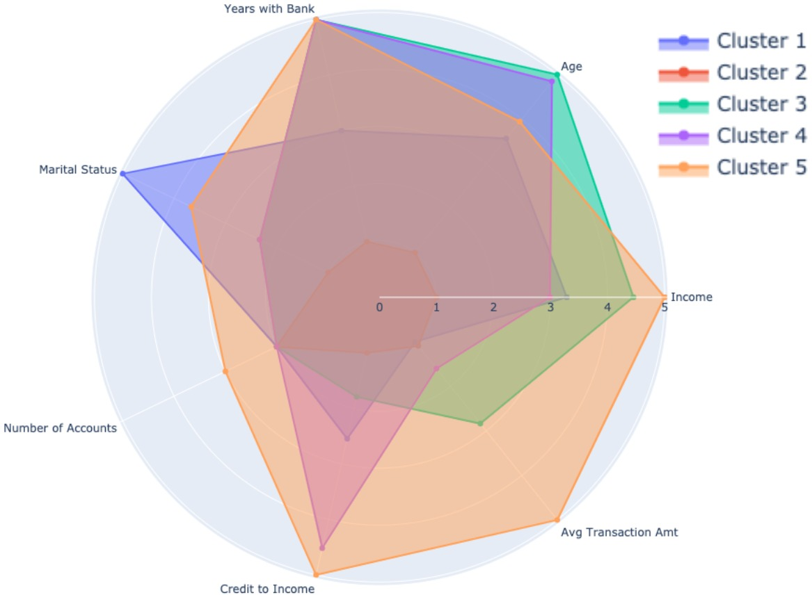

# **Clustering Bank Customers**

- **What**: Identify customer groups & demographics from banking behaviour data
- **How**: Through EDA, feature engineering, PCA and K-means clustering 
- **Why**: Better understand different types of customers and how best to serve their needs on our service. This will enable better customer engagement and satisfaction with our service offerings, ultimately creating increased brand equity. 

## **Process**

 

## **Data**
Account and transaction data from customers in 1995 has been used for this project. Connecting to an externally hosted database I explores the structure and relationships between tables using SQL. Initial EDA was then done server side and only when needed data was extracted to be using in a Jupyter Notebook. 

I have included a SQLite file in this repo to show the data being worked with if you would like to explore. There is also a 'sql_scrap' file which I used as a rough doc to do a few basic queries. 

 

## **Results**
The aim was to keep our clusters to a maximum of 5. 

- Approach 1: Using only demographic data from accounts
- Approach 2: Using transactional data to cluster

 

### **Approach 1:** Demographic Data
Cleaning and transforming the data features used were: 

PCA was then used to allow visualizations in lower dimensions. As a rule of thumb, the aim was to have 85% of variance explained in the reduced dimensions. 

 

### **Approach 2:** Transactional Data
For this approach I explored engineering a variety of features. The final two I landed on that had beneficial impact in segmenting customers was: 
- Credit to Income Ratio
- Avg spend per transaction

As seen in the Cumulative Explained Variance and Scree plots bellow, 6 dimensions was the sweet spot for explaining 85% of the variance. This however does make it more difficult to visualize the total relationships as we only have 2/3/4 dimensions that we can perceive. 

Plotting these in 3 dimensions we can see some clear segmentation. This can be tuned further to segment more groups that the current 5. 

Creating a Radio Chart of the 5 customer groups we can see some clear parameters of each. 

Side by side we can see the different attributes of each group more clearly

 

## Conclusion
Clustering demographic & transaction data is a start to better understand our customers. Through building this knowledge we are to better serve user needs, optimize product offerings and ultimately take a step towards personalization at scale. 

[Back to Top](https://github.com/The-Powder-of-Data/Clustering_Customers#clustering-bank-customers)